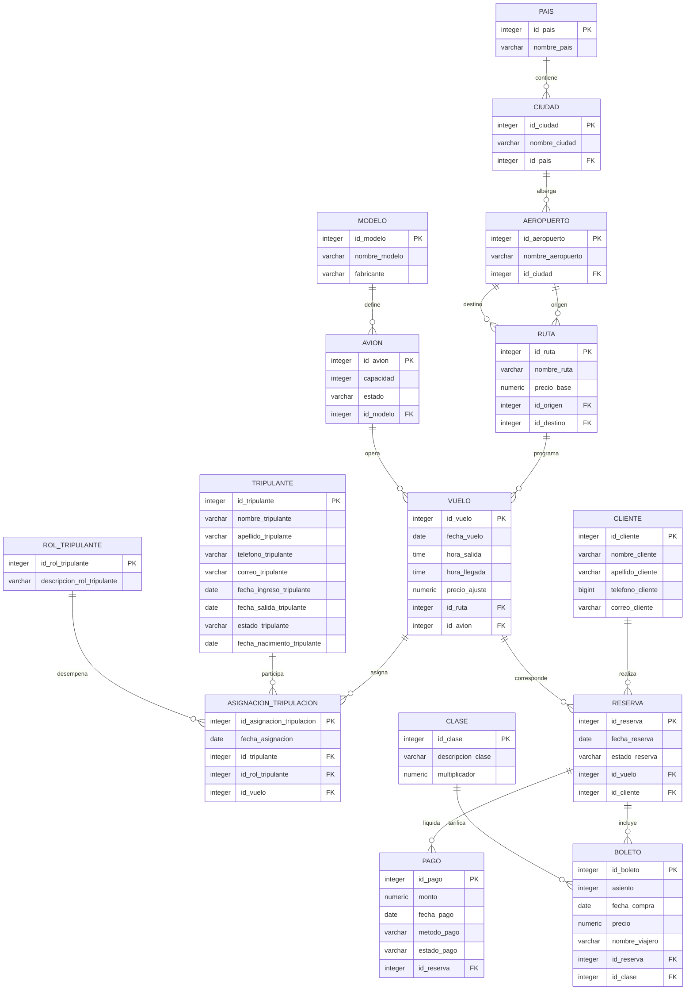

# Sistema de Gestión de Vuelos Directos de Aerolíneas (SGVDA)

Proyecto final del curso de Bases de Datos — Universidad Nacional de Colombia,
Facultad de Ingeniería.

**Autores:**
- Michelle Alejandra Gómez Sánchez
- Julián Santiago Sánchez Castro

Base de datos relacional en PostgreSQL para gestionar las operaciones de una
aerolínea: rutas, vuelos, tripulación, flota, reservas, pagos y boletos.

## Estructura del repositorio

```
.
├── componentes/                # cada script por separado (una pieza del proyecto)
│   ├── proyectoo.txt           # esquema, secuencias, tablas, PK, FK y constraints
│   ├── indices.txt             # índices adicionales sobre FK y columnas de filtro frecuente
│   ├── funciones.txt           # funciones PL/pgSQL de las reglas de negocio
│   ├── triggers.txt            # triggers que activan esas funciones
│   ├── llenado_datos.txt       # datos de prueba (60 registros por tabla, con excepciones)
│   └── consultas.txt           # 5 consultas DQL que soportan interfaces de usuario reales
├── script_general.txt          # TODO lo anterior unido, en orden, con guía de ejecución
├── documentacion_proyecto.md   # documentación detallada del modelo y decisiones de diseño
├── diagrama_er.png             # imagen en alta resolución del diagrama E-R
├── diagrama_er.svg             # diagrama vectorial escalable
├── diagrama_relacional.png     # diagrama del modelo relacional normalizado
├── diagrama_relacional.svg     # diagrama relacional en formato SVG
└── README.md                    # este archivo
```

## Diagrama Entidad-Relación y Modelo Relacional



> 💡 **Archivos descargables del diagrama:** [diagrama_er.png (Imagen HD con fondo blanco)](./diagrama_er.png) · [diagrama_er.svg (Vectorial)](./diagrama_er.svg) · [Documentación detallada](./documentacion_proyecto.md)

## Orden de ejecución

Ya sea corriendo `script_general.txt` de una sola vez, o los archivos de
`componentes/` por separado, el orden es el mismo:

1. **`proyectoo.txt`** — crea el esquema `aerolinea`, las 15 tablas, sus secuencias,
   llaves primarias, llaves foráneas y constraints de integridad.
2. **`indices.txt`** — crea índices adicionales sobre columnas de llave foránea y
   columnas usadas en filtros/joins frecuentes (fechas, estados, nombres).
3. **`funciones.txt`** — crea las funciones PL/pgSQL que implementan las reglas de negocio.
4. **`triggers.txt`** — crea los triggers que invocan esas funciones sobre las tablas correspondientes.
5. **`llenado_datos.txt`** — inserta los datos de prueba. Al ejecutarse dispara los
   triggers (cálculo automático de precios, control de capacidad, actualización de
   estado de reserva según el pago), por lo que también sirve como primera validación
   de que las reglas de negocio funcionan.
6. **`consultas.txt`** — consultas de solo lectura (DQL) para verificar que la base
   de datos responde correctamente a los casos de uso definidos.

```bash
# Opción 1: un solo archivo con todo
psql -U <usuario> -d <base_de_datos> -f script_general.txt

# Opción 2: por componentes, respetando el orden
psql -U <usuario> -d <base_de_datos> -f componentes/proyectoo.txt
psql -U <usuario> -d <base_de_datos> -f componentes/indices.txt
psql -U <usuario> -d <base_de_datos> -f componentes/funciones.txt
psql -U <usuario> -d <base_de_datos> -f componentes/triggers.txt
psql -U <usuario> -d <base_de_datos> -f componentes/llenado_datos.txt
psql -U <usuario> -d <base_de_datos> -f componentes/consultas.txt
```

## Modelo de datos

15 tablas: `pais`, `ciudad`, `aeropuerto`, `ruta`, `vuelo`, `avion`, `modelo`,
`tripulante`, `rol_tripulante`, `asignacion_tripulacion`, `cliente`, `reserva`,
`pago`, `boleto`, `clase`. El detalle de cada tabla, sus relaciones y las
decisiones de diseño tomadas están en [`documentacion_proyecto.md`](./documentacion_proyecto.md).

## Reglas de negocio (funciones/triggers)

| # | Regla | Tabla / evento |
|---|---|---|
| 1 | Un tripulante no puede tener asignaciones en vuelos con horario cruzado el mismo día | `asignacion_tripulacion` |
| 2 | El precio del boleto se calcula automáticamente | `boleto` |
| 3 | No se puede vender un boleto si ya se alcanzó la capacidad del avión | `boleto` |
| 4 | El estado de la reserva se actualiza según el estado del pago | `pago` |
| 5 | No se puede reservar un vuelo cuya fecha ya pasó | `reserva` |
| 6 (adicional) | Origen y destino de una ruta no pueden ser la misma ciudad | `ruta` |

Se pidieron mínimo 5 reglas; el proyecto implementa 6.

## Datos de prueba

`llenado_datos.txt` carga 60 registros en 13 de las 15 tablas. `rol_tripulante`
(6 registros) y `clase` (4 registros) quedan con menos porque son catálogos con
un dominio de valores naturalmente pequeño y fijo en la vida real (el enunciado
permite menos del mínimo "en donde sea posible"). Los IDs no se insertan
manualmente: cada tabla los genera con su propia secuencia (`nextval`), en el
mismo orden en que se cargan los `insert`.

## Consultas DQL

Las 5 consultas en `consultas.txt` están pensadas para interfaces de usuario
concretas (buscador de vuelos, detalle de reserva, manifiesto de tripulación,
dashboard de ingresos por ruta, historial de un cliente). Cada una incluye un
comentario explicando para qué interfaz sirve y por qué.
