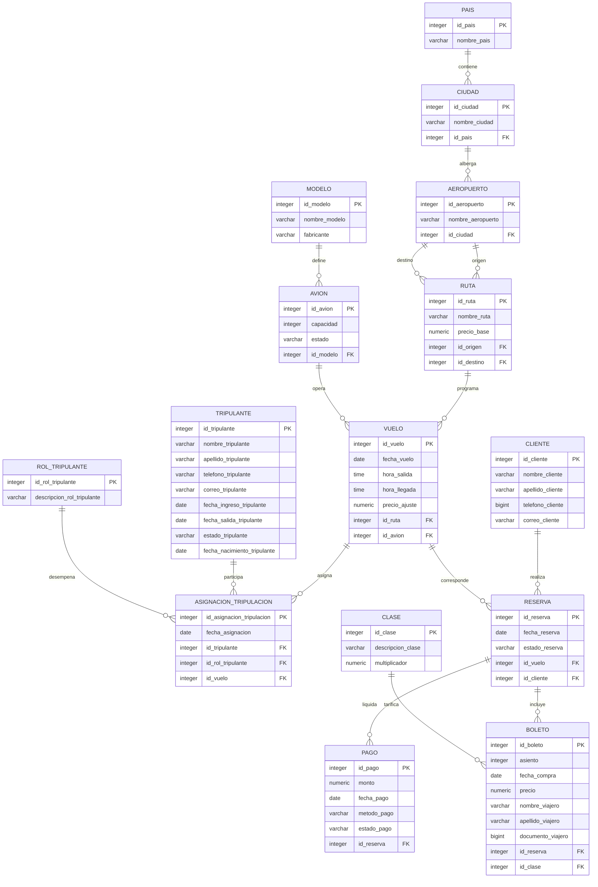

# Documentación Técnica — Sistema de Gestión de Vuelos Directos de Aerolíneas (SGVDA)

**Universidad Nacional de Colombia — Facultad de Ingeniería**  
**Asignatura:** Bases de Datos  
**Autores:** Michelle Alejandra Gómez Sánchez, Julián Santiago Sánchez Castro  
**Motor de Base de Datos:** PostgreSQL 14+ (compatible con PostgreSQL 18)

---

## 1. Descripción General del Sistema

El **Sistema de Gestión de Vuelos Directos de Aerolíneas (SGVDA)** es una solución relacional diseñada para modelar y administrar la operación de vuelos comerciales punto a punto (sin escalas). El sistema abarca desde la infraestructura operativa (flota de aviones, modelos, rutas, aeropuertos y tripulación) hasta el ciclo comercial y financiero (clientes, reservas de pasajes, emisión de boletos por clases tarifarias y procesamiento de pagos).

### 1.1 Esquema de Base de Datos
Todas las estructuras se alojan bajo el esquema dedicado `aerolinea`, garantizando aislamiento y modularidad dentro de la base de datos:
```sql
CREATE SCHEMA aerolinea;
SET search_path TO aerolinea;
```

---

## 2. Diagrama Entidad-Relación y Modelo Relacional

A continuación se presenta la estructura relacional y sus dependencias de clave foránea:



---

## 3. Diccionario de Datos (15 Tablas)

Todas las claves primarias autoincrementales utilizan secuencias dedicadas vinculadas mediante la cláusula `OWNED BY`, con restricción de rango (`CHECK (id BETWEEN 1 AND 999)`).

### 3.1 Infraestructura Geográfica y Rutas

#### Tabla: `pais`
Catálogo de naciones donde la aerolínea mantiene operaciones.
| Columna | Tipo de Dato | Nulidad | Restricciones / Notas |
|---|---|---|---|
| `id_pais` | `integer` | NOT NULL | PK, Default `nextval('seq_pais')`, Check (1..999) |
| `nombre_pais` | `varchar(100)` | NOT NULL | Nombre oficial del país |

#### Tabla: `ciudad`
Ciudades en las que se ubican los aeropuertos.
| Columna | Tipo de Dato | Nulidad | Restricciones / Notas |
|---|---|---|---|
| `id_ciudad` | `integer` | NOT NULL | PK, Default `nextval('seq_ciudad')`, Check (1..999) |
| `nombre_ciudad` | `varchar(100)` | NOT NULL | Nombre de la ciudad |
| `id_pais` | `integer` | NULLABLE | FK -> `pais(id_pais)`, Check (1..999) |

#### Tabla: `aeropuerto`
Instalaciones aeroportuarias de origen y destino.
| Columna | Tipo de Dato | Nulidad | Restricciones / Notas |
|---|---|---|---|
| `id_aeropuerto` | `integer` | NOT NULL | PK, Default `nextval('seq_aeropuerto')`, Check (1..999) |
| `nombre_aeropuerto` | `varchar(100)` | NOT NULL | Nombre distintivo del aeropuerto |
| `id_ciudad` | `integer` | NULLABLE | FK -> `ciudad(id_ciudad)`, Check (1..999) |

#### Tabla: `ruta`
Trayectos predefinidos punto a punto con tarifa base.
| Columna | Tipo de Dato | Nulidad | Restricciones / Notas |
|---|---|---|---|
| `id_ruta` | `integer` | NOT NULL | PK, Default `nextval('seq_ruta')`, Check (1..999) |
| `nombre_ruta` | `varchar(100)` | NOT NULL | Descripción textual (ej. 'Bogotá - Madrid') |
| `precio_base` | `numeric(10,2)` | NOT NULL | Tarifa estándar de la ruta |
| `id_origen` | `integer` | NULLABLE | FK -> `aeropuerto(id_aeropuerto)` |
| `id_destino` | `integer` | NULLABLE | FK -> `aeropuerto(id_aeropuerto)` |
*Constraint adicional:* `chk_ruta_origen_distinto_destino` (`id_origen <> id_destino`).

---

### 3.2 Flota Aérea y Programación de Vuelos

#### Tabla: `modelo`
Catálogo de modelos y fabricantes aeronáuticos.
| Columna | Tipo de Dato | Nulidad | Restricciones / Notas |
|---|---|---|---|
| `id_modelo` | `integer` | NOT NULL | PK, Default `nextval('seq_modelo')`, Check (1..999) |
| `nombre_modelo` | `varchar(100)` | NOT NULL | Código o denominación (ej. '737-800', 'A320neo') |
| `fabricante` | `varchar(100)` | NOT NULL | Compañía constructora (ej. 'Boeing', 'Airbus') |

#### Tabla: `avion`
Aeronaves físicas que componen la flota activa.
| Columna | Tipo de Dato | Nulidad | Restricciones / Notas |
|---|---|---|---|
| `id_avion` | `integer` | NOT NULL | PK, Default `nextval('seq_avion')`, Check (1..999) |
| `capacidad` | `integer` | NOT NULL | Número máximo de asientos disponibles |
| `estado` | `varchar(100)` | NOT NULL | 'activo', 'mantenimiento', 'inactivo' |
| `id_modelo` | `integer` | NULLABLE | FK -> `modelo(id_modelo)` |

#### Tabla: `vuelo`
Instancias concretas de una ruta programada para una fecha y hora específicas.
| Columna | Tipo de Dato | Nulidad | Restricciones / Notas |
|---|---|---|---|
| `id_vuelo` | `integer` | NOT NULL | PK, Default `nextval('seq_vuelo')`, Check (1..999) |
| `fecha_vuelo` | `date` | NOT NULL | Día del servicio |
| `hora_salida` | `time` | NOT NULL | Hora programada de despegue |
| `hora_llegada` | `time` | NOT NULL | Hora programada de aterrizaje |
| `precio_ajuste` | `numeric(10,2)` | NOT NULL | Variación por temporada, demanda u horario |
| `id_ruta` | `integer` | NULLABLE | FK -> `ruta(id_ruta)` |
| `id_avion` | `integer` | NULLABLE | FK -> `avion(id_avion)` |

---

### 3.3 Tripulación y Asignaciones

#### Tabla: `rol_tripulante`
Catálogo de funciones operativas y de cabina.
| Columna | Tipo de Dato | Nulidad | Restricciones / Notas |
|---|---|---|---|
| `id_rol_tripulante` | `integer` | NOT NULL | PK, Default `nextval('seq_rol_tripulante')` |
| `descripcion_rol_tripulante` | `varchar(100)` | NOT NULL | 'Piloto', 'Copiloto', 'Jefe de cabina', etc. |

#### Tabla: `tripulante`
Personal contratado por la compañía.
| Columna | Tipo de Dato | Nulidad | Restricciones / Notas |
|---|---|---|---|
| `id_tripulante` | `integer` | NOT NULL | PK, Default `nextval('seq_tripulante')` |
| `nombre_tripulante` | `varchar(100)` | NOT NULL | Nombre de pila |
| `apellido_tripulante` | `varchar(100)` | NOT NULL | Apellidos |
| `telefono_tripulante` | `varchar(100)` | NOT NULL | Teléfono de contacto |
| `correo_tripulante` | `varchar(100)` | NOT NULL | Correo corporativo |
| `fecha_ingreso_tripulante` | `date` | NOT NULL | Fecha de vinculación laboral |
| `fecha_salida_tripulante` | `date` | NULLABLE | Fecha de desvinculación |
| `estado_tripulante` | `varchar(100)` | NOT NULL | 'activo', etc. |
| `fecha_nacimiento_tripulante` | `date` | NOT NULL | Fecha de nacimiento |

#### Tabla: `asignacion_tripulacion`
Entidad asociativa que asigna un tripulante a un vuelo en un rol determinado.
| Columna | Tipo de Dato | Nulidad | Restricciones / Notas |
|---|---|---|---|
| `id_asignacion_tripulacion` | `integer` | NOT NULL | PK, Default `nextval('seq_asignacion_tripulacion')` |
| `fecha_asignacion` | `date` | NOT NULL | Fecha de registro del rol |
| `id_tripulante` | `integer` | NULLABLE | FK -> `tripulante(id_tripulante)` |
| `id_rol_tripulante` | `integer` | NULLABLE | FK -> `rol_tripulante(id_rol_tripulante)` |
| `id_vuelo` | `integer` | NULLABLE | FK -> `vuelo(id_vuelo)` |

---

### 3.4 Clientes, Reservas, Pagos y Boletos

#### Tabla: `cliente`
Usuarios que realizan y gestionan reservas en la plataforma.
| Columna | Tipo de Dato | Nulidad | Restricciones / Notas |
|---|---|---|---|
| `id_cliente` | `integer` | NOT NULL | PK, Default `nextval('seq_cliente')` |
| `nombre_cliente` | `varchar(100)` | NOT NULL | Nombres |
| `apellido_cliente` | `varchar(100)` | NOT NULL | Apellidos |
| `telefono_cliente` | `bigint` | NOT NULL | Teléfono (uso de `bigint` para admitir números de 10 dígitos) |
| `correo_cliente` | `varchar(100)` | NOT NULL | Correo de contacto |

#### Tabla: `reserva`
Transacción que vincula a un cliente con un vuelo y agrupa boletos y pagos.
| Columna | Tipo de Dato | Nulidad | Restricciones / Notas |
|---|---|---|---|
| `id_reserva` | `integer` | NOT NULL | PK, Default `nextval('seq_reserva')` |
| `fecha_reserva` | `date` | NOT NULL | Fecha de creación de la reserva |
| `estado_reserva` | `varchar(100)` | NOT NULL | 'pendiente', 'confirmada' |
| `id_vuelo` | `integer` | NULLABLE | FK -> `vuelo(id_vuelo)` |
| `id_cliente` | `integer` | NULLABLE | FK -> `cliente(id_cliente)` |

#### Tabla: `pago`
Registro de cobros asociados a reservas.
| Columna | Tipo de Dato | Nulidad | Restricciones / Notas |
|---|---|---|---|
| `id_pago` | `integer` | NOT NULL | PK, Default `nextval('seq_pago')` |
| `monto` | `numeric(10,2)` | NOT NULL | Valor liquidado |
| `fecha_pago` | `date` | NOT NULL | Fecha de la operación bancaria |
| `metodo_pago` | `varchar(100)` | NOT NULL | 'tarjeta_credito', 'tarjeta_debito', 'pse', 'efectivo' |
| `estado_pago` | `varchar(100)` | NOT NULL | 'completado', 'pendiente', 'rechazado' |
| `id_reserva` | `integer` | NULLABLE | FK -> `reserva(id_reserva)` |

#### Tabla: `clase`
Catálogo de cabinas y factor tarifario.
| Columna | Tipo de Dato | Nulidad | Restricciones / Notas |
|---|---|---|---|
| `id_clase` | `integer` | NOT NULL | PK, Default `nextval('seq_clase')` |
| `descripcion_clase` | `varchar(100)` | NOT NULL | 'Económica', 'Económica premium', 'Ejecutiva', 'Primera clase' |
| `multiplicador` | `numeric(10,2)` | NOT NULL | Factor sobre la tarifa base (1.0, 1.3, 1.8, 2.5) |

#### Tabla: `boleto`
Ticket emitido a nombre de un viajero específico.
| Columna | Tipo de Dato | Nulidad | Restricciones / Notas |
|---|---|---|---|
| `id_boleto` | `integer` | NOT NULL | PK, Default `nextval('seq_boleto')` |
| `asiento` | `integer` | NOT NULL | Número de silla en el avión |
| `fecha_compra` | `date` | NOT NULL | Fecha de compra |
| `precio` | `numeric(10,2)` | NOT NULL | Tarifa calculada automáticamente por trigger |
| `nombre_viajero` | `varchar(100)` | NOT NULL | Nombre del pasajero |
| `apellido_viajero` | `varchar(100)` | NOT NULL | Apellido del pasajero |
| `documento_viajero` | `bigint` | NOT NULL | Cédula/pasaporte (uso de `bigint` para números grandes) |
| `id_reserva` | `integer` | NULLABLE | FK -> `reserva(id_reserva)` |
| `id_clase` | `integer` | NULLABLE | FK -> `clase(id_clase)` |

---

## 4. Decisiones de Diseño

1. **Separación de Ruta y Vuelo:**
   - Una `ruta` representa el par conceptual origen/destino y su precio de base.
   - Un `vuelo` es la materialización en una fecha, hora, aeronave asignada y con un recargo de precio dinámico (`precio_ajuste`).
2. **Distinción entre Cliente y Viajero:**
   - Un cliente corporativo o jefe de familia (`cliente`) puede realizar una `reserva` que contenga varios `boletos` a nombre de diferentes personas (`viajeros`).
3. **Uso de `bigint` en identificadores ciudadanos y teléfonos:**
   - Los números telefónicos móviles en Colombia (formato `3XXXXXXXXX`) y cédulas de ciudadanía modernas superan el valor máximo de un `integer` de 32 bits con signo (\(2^{31}-1 = 2\,147\,483\,647\)). Se implementó `bigint` para prevenir excepciones por desbordamiento numérico.
4. **Tarificación automática mediante Triggers:**
   - El precio del boleto no es fijado manualmente por el usuario, evitando manipulaciones externas y garantizando consistencia tarifaria mediante la fórmula:
     $$\text{precio} = (\text{precio\_base} + \text{precio\_ajuste}) \times \text{multiplicador}$$

---

## 5. Reglas de Negocio (PL/pgSQL y Triggers)

| # | Regla de Negocio | Función PL/pgSQL | Trigger / Evento |
|---|---|---|---|
| **1** | Un tripulante no puede tener asignaciones en vuelos con horarios superpuestos el mismo día | `fn_validar_asignacion_tripulante()` | `trg_validar_asignacion_tripulante` (BEFORE INSERT/UPDATE en `asignacion_tripulacion`) |
| **2** | El precio del boleto se calcula dinámicamente según ruta, ajuste de vuelo y clase | `fn_calcular_precio_boleto()` | `trg_calcular_precio_boleto` (BEFORE INSERT en `boleto`) |
| **3** | Control de sobreventa: no vender boletos si se alcanzó la capacidad del avión | `fn_validar_capacidad_avion()` | `trg_validar_capacidad_avion` (BEFORE INSERT en `boleto`) |
| **4** | Sincronización automática de estado de reserva según estado del pago | `fn_actualizar_estado_reserva()` | `trg_actualizar_estado_reserva` (AFTER INSERT/UPDATE en `pago`) |
| **5** | No se puede crear una reserva sobre un vuelo cuya fecha ya pasó al momento de reservar | `fn_validar_fecha_vuelo_reserva()` | `trg_validar_fecha_vuelo_reserva` (BEFORE INSERT en `reserva`) |
| **6** | Una ruta no puede tener origen y destino en la misma ciudad | `fn_validar_ciudades_ruta()` | `trg_validar_ciudades_ruta` (BEFORE INSERT/UPDATE en `ruta`) |

### Detalle de la Regla 5: Manejo Temporal Robusto
Para permitir tanto el procesamiento de reservas en tiempo real como la carga de datos históricos y de pruebas reproducibles en cualquier momento del tiempo, la validación se ejecuta evaluando:
```sql
if v_fecha_vuelo < coalesce(new.fecha_reserva, current_date) then
    raise exception 'No se puede reservar el vuelo %: la fecha del vuelo (%) ya pasó respecto a la fecha de la reserva (%)',
        new.id_vuelo, v_fecha_vuelo, coalesce(new.fecha_reserva, current_date);
end if;
```
Esto garantiza que:
- En reservas nuevas donde `fecha_reserva` es la fecha actual (`current_date`), no se pueda reservar ningún vuelo anterior a hoy.
- En la carga de lotes de prueba o históricos, se asegure que en la fecha que se reservó el pasaje el vuelo aún estaba en el futuro (`fecha_reserva <= fecha_vuelo`), sin verse afectado por la fecha en que se ejecute el script SQL.

---

## 6. Estrategia de Indexación

El script [indices.txt](./componentes/indices.txt) define índices B-Tree sobre columnas con alta frecuencia de joins, filtros y agrupaciones:

1. **Búsqueda de vuelos:** `idx_vuelo_fecha` (`fecha_vuelo`), `idx_vuelo_ruta` (`id_ruta`), `idx_vuelo_avion` (`id_avion`).
2. **Topología de red:** `idx_aeropuerto_ciudad`, `idx_aeropuerto_nombre`, `idx_ruta_origen`, `idx_ruta_destino`, `idx_ciudad_pais`.
3. **Gestión de reservas y clientes:** `idx_reserva_cliente`, `idx_reserva_vuelo`, `idx_reserva_estado`.
4. **Venta y tarifas:** `idx_boleto_reserva`, `idx_boleto_clase`.
5. **Transacciones financieras:** `idx_pago_reserva`, `idx_pago_estado`.
6. **Operaciones de tripulación:** `idx_asignacion_vuelo`, `idx_asignacion_tripulante`.

---

## 7. Consultas DQL y Casos de Uso de Negocio

Las 5 consultas implementadas en [consultas.txt](./componentes/consultas.txt) responden a necesidades directas de pantallas e interfaces de usuario:

1. **Consulta 1 — Buscador de Vuelos Disponibles:**
   - *Interfaz:* Motor de búsqueda para clientes en la página web / app móvil.
   - *Funcionalidad:* Filtra por aeropuerto origen, aeropuerto destino y fecha, calculando dinámicamente los asientos disponibles (`capacidad - boletos_vendidos`) y descartando vuelos agotados (`HAVING asientos_disponibles > 0`).
2. **Consulta 2 — Detalle de Reserva ("Mi Reserva" / Check-in):**
   - *Interfaz:* Pantalla de consulta de itinerario o módulo de mostrador de check-in.
   - *Funcionalidad:* Dado un código de reserva, lista todos los viajeros, asientos asignados, clase de vuelo, tarifa y estado del pago asociado.
3. **Consulta 3 — Manifiesto de Vuelo Operativo:**
   - *Interfaz:* Panel de control para personal de operaciones terrestres y despacho de vuelos.
   - *Funcionalidad:* Lista la tripulación asignada al vuelo con sus nombres, teléfonos y roles (Piloto, Copiloto, Auxiliares) previo al despegue.
4. **Consulta 4 — Tablero Gerencial de Ingresos por Ruta:**
   - *Interfaz:* Dashboard analítico de rendimiento comercial.
   - *Funcionalidad:* Agrupa boletos vendidos e ingresos totales en un rango de fechas por ruta, considerando **exclusivamente pagos con estado 'completado'** para evitar contabilizar reservas abandonadas o transacciones rechazadas.
5. **Consulta 5 — Historial de Viajes y Gasto Fidelizado:**
   - *Interfaz:* Área privada del cliente / programa de millas y fidelización.
   - *Funcionalidad:* Consolida el número de reservas pagadas, boletos emitidos y gasto monetario total efectivo acumulado por un cliente específico.
